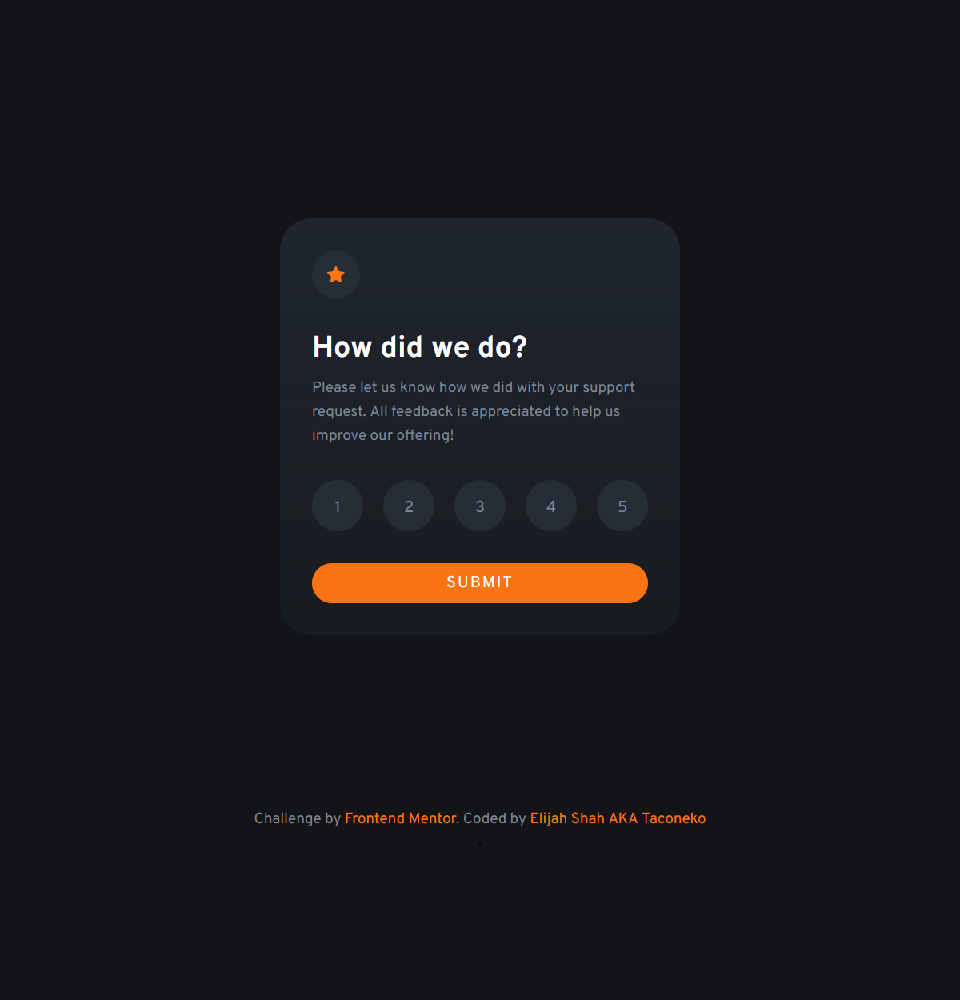
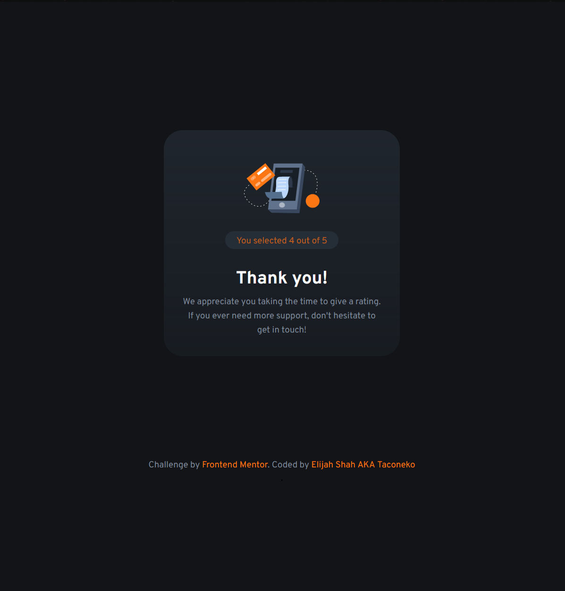

# Frontend Mentor - Interactive rating component solution

This is a solution to the [Interactive rating component challenge on Frontend Mentor](https://www.frontendmentor.io/challenges/interactive-rating-component-koxpeBUmI). Frontend Mentor challenges help you improve your coding skills by building realistic projects. 

## Table of contents

- [Overview](#overview)
  - [The challenge](#the-challenge)
  - [Screenshot](#screenshot)
  - [Links](#links)
- [My process](#my-process)
  - [Built with](#built-with)
  - [What I learned](#what-i-learned)
  - [Continued development](#continued-development)
  - [Useful resources](#useful-resources)
- [Author](#author)
- [Acknowledgments](#acknowledgments)

## Overview

I tried to focus too much on making the site accessible. I don't know if I did well. I could definitely have achieved this in a much easier way and way quicker, if I didn't care. Unfortunately, I do.

### The challenge

Users should be able to:

- View the optimal layout for the app depending on their device's screen size
- See hover states for all interactive elements on the page
- Select and submit a number rating
- See the "Thank you" card state after submitting a rating

### Screenshot

### Links

- Solution URL: [Add solution URL here](https://your-solution-url.com)
- Live Site URL: [Add live site URL here](https://your-live-site-url.com)

## My process

I spent way too much time on this. Almost a whole day. I ADHD hyperfixated on it and forgot to eat or sleep, and it's still not perfect. But I guess it's something a lot of people won't notice...

### Built with

- Semantic HTML5 markup
- CSS custom properties
- Flexbox
- Mobile-first workflow
- Sass
- Javascript

### What I learned

I learnt that I am very very tired and sleep deprived and I am going to bed.

I learnt a lot about tabindex, though. That gave me hell when trying to make this accessible. It's still not perfect... the hover states don't carry over very well from mouse to keyboard navigation. There's only so much I can do though without writing insane amounts of code.

### Continued development

I want to learn how to refactor my code properly. I don't know how to do it well without breaking it. I had to ask ChatGPT for advice. You know I'm desperate when I go to an AI that might end my career before it begins, for help.

### Useful resources

- ChatGPT. I do not like you much, but you helped. This time.

## Author

- Frontend Mentor - [@taco-neko](https://www.frontendmentor.io/profile/taco-neko)

## Acknowledgments

- Dirtblort for telling me cool knife facts
